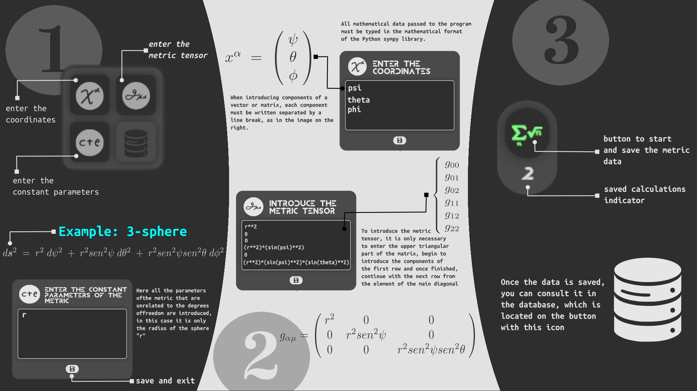

<h2 align="center"> Metric3 </h2>

## Table of Contents
- [Description](#description)
- [Use of the application](#use-of-the-application)
- [Developer Information](#developer-information)
- [Installation](#installation)

## Description
Metric 3 is an application that calculates the curvature scalar, 
the Ricci tensor, the Riemann tensor, and the connections for any type 
of metric the user wishes to study.

The distinguishing feature of the application is that, although it has been 
developed in Python, it is aimed at mobile devices ("Android"). This makes it 
a fast and portable calculator, ideal for reviewing the analytical 
calculations of metrics like those studied in general relativity.

## Use of the application
Below is an illustrative image of the different components of the program 
and an example of use with the 3-sphere metric.

<p align="center">
  
</p>

>[!NOTE]  
> The expansion of the indices starts from zero, so the first component in the index 
>notation has a subscript or superscript "0".

## Developer Information
The application is fully developed in Python, and all the development libraries 
can be installed using pip:

```sh
pip install pandas sympy flet matplotlib
```


## Installation
The application is developed with Flet and has the ability to be multiplatform 
("PC" or "mobile"). However, it has only been compiled for Android:

<!-- [APK download link](https://github.com/Angell6991/Nur_cal/releases/download/v0.1.0-beta/nur-cal.apk) -->

If you wish to have the version for iPhone or PC, you are invited to download the 
source code and compile it by 
consulting: [the flet documentation](https://flet.dev/docs/publish)


